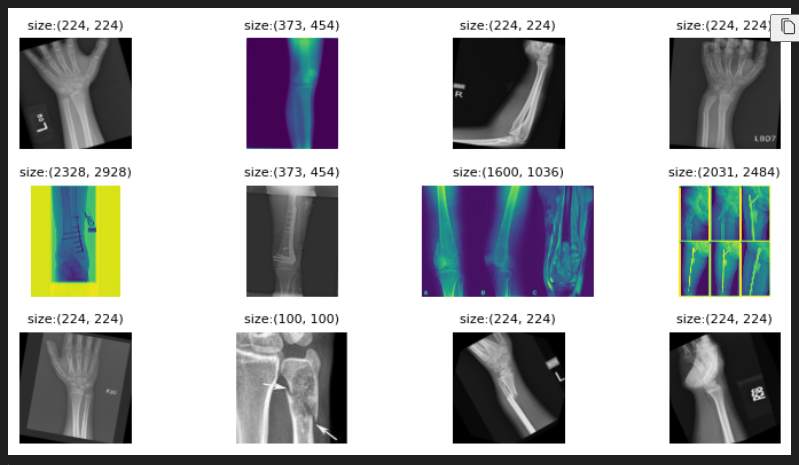

# Fracture_Bone_Prediction

This repository was accepted at GOODTECHS-2025 with title `A Model Fine-tuning Strategy for Fracture Detection from X-ray Images`.
It contains a computer vision project implemented in Python using Jupyter Notebook and Streamlit for deployment. The goal of this project is to analyze and process images from fracture bone datasets to achieve a specific object detection task 


You can download dataset here [Dataset](https://drive.google.com/drive/folders/1h5lIBfUuc8mnh2PIxwXOUJloqk4ciSMj?usp=sharing)
Weight model: [Weight](https://drive.google.com/drive/folders/1bHws5HjavQFbnSz0EPteM1r5_Of1ngzF?usp=sharing)


## 📌 Requirements

Make sure to install the required libraries before running the project:

```bash
pip install -r requirements.txt
```

## Optional: Create Virutal Environment

> In the directory containing the project, run the following command to create the virtual environment `venv`:

```bash
python -m venv myenv
```

> After creating the virtual environment, activate it with the command

```bash
myenv\Scripts\activate
```

> You can also disable venv if needed with the command

```bash
deactivate
```

### :rocket: How to run

1. Clone the repository:
``` bash
git clone https://github.com/VietHoang0805/Fracture_Bone_Prediction.git
cd Fracture_Bone_Prediction
```

2. Run the notebook:

+ Open [Model RESNET18](Notebook/resnet18-bone-fracture.ipynb) in Jupyter Notebook or JupyterLab.

+ Open [Model VIT](Notebook/vit-bone-fracture.ipynb) in Jupyter Notebook or JupyterLab.

+ Open [Model DENSENET](Notebook/densenet-bone-fracture.ipynb) in Jupyter Notebook or JupyterLab.

+ Open [Model MOBILENET](Notebook/mobilenet-bone-fracture.ipynb) in Jupyter Notebook or JupyterLab.

You can see input image



3. Create folder contains weight

``` bash
cd Fracture_Bone_Prediction/Streamlit
mkdir Model
```
Download [Weight](https://drive.google.com/drive/folders/1bHws5HjavQFbnSz0EPteM1r5_Of1ngzF?usp=sharing) and put weight model

4. Launch the Streamlit app:
``` bash
streamlit run Streamlit/app.py
```
After run [app.py](Streamlit/app.py "Streamlit") you can see UI below

Image UI here: [StreamlitUI](/Images/Streamlit.png) 


You can use [Image Test](Images/Test) or other to test

5. Result model:


| Model      | Accuracy | Precision | Recall | F1 Score |
|------------|----------|-----------|--------|----------|
| ResNet18   | 93.68%   | 93.91%    | 93.49% | 93.63%   |
| MobileNetV2| 92.89%   | 92.86%    | 92.86% | 92.86%   |
| DenseNet121| 94.86%   | 94.83%    | 94.98% | 94.86%   |
| ViT        | 97.83%   | 97.79%    | 97.85% | 97.82%   |
